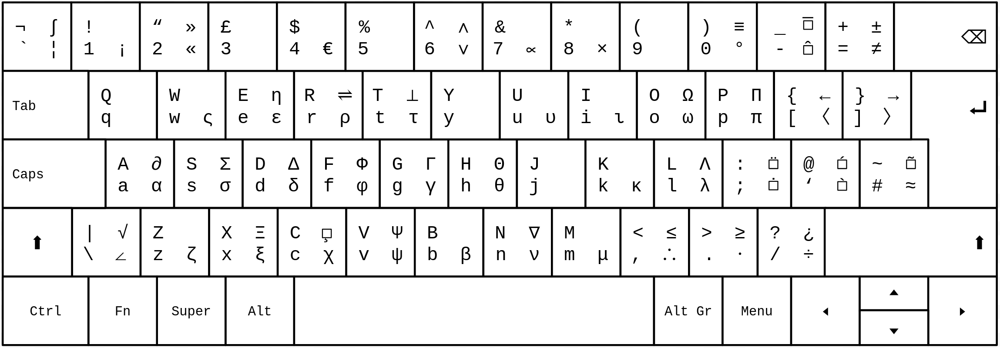

# English-Mathematical-Keyboard
English (UK) Mathematical Keyboard Code for Ubuntu 24.04.3 LTS

## Layout
Shift key pressed: Symbols in upper row will be typed<br>
Alternate character key pressed: Symbols in right column will be typed<br>


## Setup Instructions
1. Copy `gbMAT` to `/usr/share/X11/xkb/symbols` folder

2. In `/usr/share/X11/xkb/rules/evdev.lst` and `/usr/share/X11/xkb/rules/base.lst`, add the following under `! layout`:
   
   ```gbMAT		  English (UK) Mathematical```
  

3. In `/usr/share/X11/xkb/rules/evdev.xml` and `/usr/share/X11/xkb/rules/base.xml`, add the following within `<layoutList>`:

```
<layout>
   <configItem>
      <name>gbMAT</name>
      <shortDescription>gbMAT</shortDescription>
      <description>English (UK) Mathematical</description>
      <countryList>
         <iso3166Id>GB</iso3166Id>
      </countryList>
      <languageList>
         <iso639Id>eng</iso639Id>
      </languageList>
    </configItem>
    <variantList/>
</layout>
```
(Ensure indentation is correct)

4. Restart

5. Settings > Keyboard > Input Sources > Add Input Source > English (UK) > English (UK) Mathematical

Note: you will need to select an alternate character key if you do not already have one selected. This allows you to type the special characters added in this keyboard. This setting is in Settings > Keyboard > Special Character Entry > Alternate Characters Key.

## Other info
Please [email me](mailto:Reya.Khan\@outlook.com) if you encounter any issues or have any suggestions! Note I'm fairly new to Linux and GitHub.
